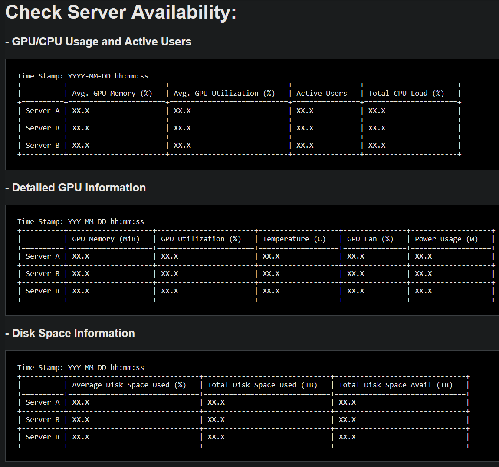

# Check Server Resources (CSR) - Minimalist Version

*In a computer science lab or tech company, managing multiple servers and GPUs for deep learning experiments can be challenging. miniCSR provides a minimalist and private webpage to monitor the resources of local 'GPU servers' (Linux based). Only you and authorized users within your network can access this webpage, offering a secure way to view detailed statistics of your GPU, CPU, and disk space resources for each server—all in one place.*

Here's an anonymized screenshot of how it looks:


---

# Installation - Configuration - Profit?
### Setting up miniCSR

- **Step 1**: Clone the project by running the following commands on your local machine—the one monitoring your servers:  
    ```bash
    git clone https://github.com/Vujas-Eteph/miniCSR
    mamba env create -f environment.yml
    ```

- **Step 2 (Optional)**: When setting up ssh connections, natively linux will save it in .ssh/config, which you can modify like below. However, you can skip this if you don't want to miggle with you current ssh configs.
    ```yaml
    # .ssh/config template
    Host SERVER_ALIAS
        HostName SERVER_IP  # Replace with actual server IP
        User USER_NAME      # Replace with actual user name
        IdentityFile ~/.ssh/id_rsa
        Port XX             # Replace with the actual port number
        UserKnownHostsFile ~/.ssh/known_hosts
    ```
- **Step 3**: Add the **SERVER_ALIAS** entries for the servers you want to monitor in the [**server_names.yaml**](./config/server_names.yaml) file (an example is provided). Using this allows you to only monitor servers you are interested in, and not every server you have ssh access to.
- **Step 4**: :moneybag: Profit from your hard labour by running the following commands:
    ```bash
    tmux new-session CSR
    mamba activate miniCSR
    bash ./start_CSR.sh
    ```

> [!NOTE]
> - We don't need to install anything on the servers that we are going to monitor, since we rely solely on basic linux commands that should already be available natively.
> - By default, the webpage is on your **local port 1990**. You can change that in the configurations. (actually to do, hard coded for now)

---

## Motivation for the project
Before CSR, I had to manually check if a server was available by SSHing into each server one by one. This process became cumbersome already at the second attempt.  
So to **save time**, I wanted a centralized monitoring tool that consolidates this task, making it quick and efficient. Hence, this project.  

---
*This project was tested on Ubuntu and relies on Python 3.*
